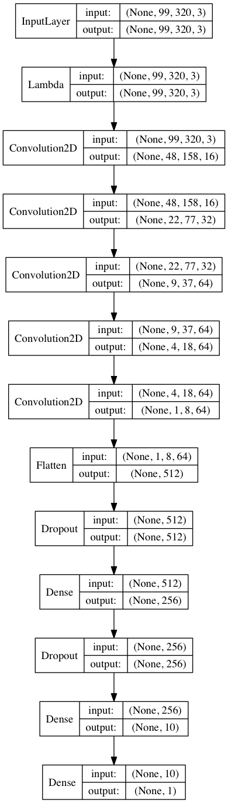

# Self-Driving-Car-Simulator
Deep Learning Behaviour Cloning for Self-Driving Car Simulator
[Udacity Self-Driving Car Engineer Nanodegree](https://www.udacity.com/drive)


This README describes how the model was trained and what the characteristics of the dataset are. Information such as how the dataset was generated and video of the images from the training dataset and the simulations are included.    

## The results
Let's start with the fun part. The model was able to learn from training set based only on the first track. It learned to drive safely and smoothly through the whole track. Also, the model generalized and is able to drive very well on the second track.

You can see the simulation driving in the following videos:
<br/> _Sorry for the picture-links, the README.md does not support video embedding._

[main track saved images](https://www.youtube.com/watch?v=U68eoUS0aAs) <br/> 
[](https://www.youtube.com/watch?v=U68eoUS0aAs) <br/> 

[second track saved images](https://www.youtube.com/watch?v=_y2hXSFbI5o) - unseen track on which it performes very well. <br/> 
[](https://www.youtube.com/watch?v=_y2hXSFbI5o) <br/> 

[main track screen recording](https://www.youtube.com/watch?v=k0G6tWCwnEE) <br/> 
[](https://www.youtube.com/watch?v=k0G6tWCwnEE) <br/> 

[second track screen recording](https://www.youtube.com/watch?v=3D6Uo3zlVvM) <br/> 
[](https://www.youtube.com/watch?v=3D6Uo3zlVvM) <br/> 


## Creation of the training dataset
The udacity self-driving-car simulator was used to generate train and CV image sets including the steering angle. <br/>
For generating the dataset I played the game on the first track only. The game resolution while playing was 640x480 with lowest quality details. The game produces images from _center_, _left_, and _right_ angle cameras and the angle position of the steering wheel in training mode, writing the images path and steering angle of the current frame to a csv file.
For the train set, I used my own recorded data from track one, including _recovery data_ and also used the training data provided by _udacity_. Used the _left_ and _right_ images with manually augmented steering angle, except recovery data for additional train data - the model learned to aim for centering between the lanes. <br/>
The dataset preparation can be found in [Prepare Train Data.ipynb](Prepare%20Train%20Data.ipynb)

The total number of generated images for training is around 55k. <br/>
You can see a video of the full training set, including augmented steering angle in the following video: <br/>
[https://www.youtube.com/watch?v=3qQvYdbr8PM](https://www.youtube.com/watch?v=3qQvYdbr8PM)

[](https://www.youtube.com/watch?v=3qQvYdbr8PM)
<br/> _Sorry for the ^^ picture-link, README.md doesn't support video embeding._
<br/> You can see the recovery data after 14:03.

## Data preprocessing

Experimented a lot with preprocessing. The final version of the model doesn't resize the train image size. Uses the 3 RGB channels. Crops the top 60px from the image (mostly trees and skies). The data normalization is done by `x / 255 - 0.5` in the first layer of the NN.
Other things I tried and removed from the final model:

* Convert image to grayscale.
* Convert image to HSL color values.
* Crop pixels from bottom.
* Resize (downscaling) image and different crop sizes.

The preprocessing step can be seen in `load_img` function in [Train-the-model.ipynb](Train-the-model.ipynb)

## Model architecture

The final model consists of: <br/>
5 convolutional layers and 3 fully connected. Activation is elu, cost function is mse (regression) and optimizer is adam.

The final model code:
```
model = Sequential()
model.add(Lambda(normalize, input_shape=input_shape))
model.add(Convolution2D(16, 5, 5, subsample=(2, 2), border_mode='valid', activation='elu'))
model.add(Convolution2D(32, 5, 5, subsample=(2, 2), border_mode='valid', activation='elu'))
model.add(Convolution2D(64, 5, 5, subsample=(2, 2), border_mode='valid', activation='elu'))
model.add(Convolution2D(64, 3, 3, subsample=(2, 2), border_mode='valid', activation='elu'))
model.add(Convolution2D(64, 3, 3, subsample=(2, 2), border_mode='valid', activation='elu'))
model.add(Flatten())
model.add(Dropout(0.5))
model.add(Dense(256, activation='elu'))
model.add(Dropout(0.5))
model.add(Dense(10, activation='elu'))
model.add(Dense(1))

adam = Adam(lr=0.0001)
model.compile(loss='mse', optimizer=adam)
model.summary()
```

And the leayers shapes:

```____________________________________________________________________________________________________
Layer (type)                     Output Shape          Param       Connected to                     
====================================================================================================
lambda_1 (Lambda)                (None, 99, 320, 3)    0           lambda_input_1[0][0]             
____________________________________________________________________________________________________
convolution2d_1 (Convolution2D)  (None, 48, 158, 16)   1216        lambda_1[0][0]                   
____________________________________________________________________________________________________
convolution2d_2 (Convolution2D)  (None, 22, 77, 32)    12832       convolution2d_1[0][0]            
____________________________________________________________________________________________________
convolution2d_3 (Convolution2D)  (None, 9, 37, 64)     51264       convolution2d_2[0][0]            
____________________________________________________________________________________________________
convolution2d_4 (Convolution2D)  (None, 4, 18, 64)     36928       convolution2d_3[0][0]            
____________________________________________________________________________________________________
convolution2d_5 (Convolution2D)  (None, 1, 8, 64)      36928       convolution2d_4[0][0]            
____________________________________________________________________________________________________
flatten_1 (Flatten)              (None, 512)           0           convolution2d_5[0][0]            
____________________________________________________________________________________________________
dropout_1 (Dropout)              (None, 512)           0           flatten_1[0][0]                  
____________________________________________________________________________________________________
dense_1 (Dense)                  (None, 256)           131328      dropout_1[0][0]                  
____________________________________________________________________________________________________
dropout_2 (Dropout)              (None, 256)           0           dense_1[0][0]                    
____________________________________________________________________________________________________
dense_2 (Dense)                  (None, 10)            2570        dropout_2[0][0]                  
____________________________________________________________________________________________________
dense_3 (Dense)                  (None, 1)             11          dense_2[0][0]                    
====================================================================================================
Total params: 273,077
Trainable params: 273,077
Non-trainable params: 0
____________________________________________________________________________________________________
```

Plot of the final model: 



## Training and evaluation

During model selection, I tried manually many different configurations of the model.
For cross-validation, I used `train_test_split` with 5% of the images held out for validation.

Things I tried:

* Activations: relu, elu, tanh, sigmoid
* Final layer: no activation, tanh activation [-1; 1]. Classification, where output is binned to 21 classes between -1 and 1.
* Learning rate values, batch sizes, and epochs.
* Architecture of the NN - different configurations of layers and sizes. 

The model training step uses a generator for the data, so not all images are stored in memory.
In the batch generator, I always augment the second half of the images, by flipping the image by the y-axis and taking the negative of the steering angle. This way the proportion of left and right steering angles balances.

The final model is trained for 20 epochs using 256 batch size. Cross validation showed this is the point where both train and cv loss are at their minimum.

## Download game simulator:
<p>We’ve created a simulator for you based on the Unity engine that uses real game physics to create a close approximation to real driving.</p>
<p>Download it here:</p>
<ul>
<li><a href="https://d17h27t6h515a5.cloudfront.net/topher/2016/November/5831f0f7_simulator-linux/simulator-linux.zip" target="_blank">Linux</a></li>
<li><a href="https://d17h27t6h515a5.cloudfront.net/topher/2016/November/5831f290_simulator-macos/simulator-macos.zip" target="_blank">macOS</a></li>
<li><a href="https://d17h27t6h515a5.cloudfront.net/topher/2016/November/5831f4b6_simulator-windows-32/simulator-windows-32.zip" target="_blank">Windows 32-bit</a></li>
<li><a href="https://d17h27t6h515a5.cloudfront.net/topher/2016/November/5831f3a4_simulator-windows-64/simulator-windows-64.zip" target="_blank">Windows 64-bit</a></li>
</ul>
<h4 id="running-the-simulator">Running the Simulator</h4>
<p>Once you’ve downloaded it, extract it and run it.</p>
<p>When you first run the simulator, you’ll see a configuration screen asking what size and graphical quality you would like. We suggest running at the smallest size and the fastest graphical quality. 
We also suggest closing most other applications (especially graphically intensive applications) on your computer, so that your machine can devote its resource to running the simulator.</p>


# Requirements for the project

## Use Deep Learning to Clone Driving Behavior

Question | Answer
------ | -------
Is the code functional? | Yes, the code is functional.
The model provided can be used to successfully operate the simulation. | Yes, the model and the drive.py file successfully operates the simulation.
Is the code usable and readable? | Yes.

The code in Train-the-model.ipynb uses a Python generator, to generate data for training rather than storing the training data in memory. The Train-the-model.ipynb code is clearly organized and comments are included where needed.
My last model code is in Train-the-model.ipynb. Left only the functional code for the final training.

## Model Architecture and Training Strategy

Question | Answer
------ | -------
Has an appropriate model architecture been employed for the task? | Yes.
The neural network uses convolution layers with appropriate filter sizes. Layers exist to introduce nonlinearity into the model. The data is normalized in the model. | Yes. Data is normalized by `x / 255 - 0.5`.
Has an attempt been made to reduce overfitting of the model? | Yes. Overfitting was achieved using CV set and dropouts. 
Train/validation/test splits have been used, and the model uses dropout layers or other methods to reduce overfitting.  | Yes.
Have the model parameters been tuned appropriately?  | Yes - manually after many hours of experimentation. No automatic parameter search performed.
Learning rate parameters are chosen with an explanation, or an Adam optimizer is used.  | Adam
Is the training data chosen appropriately?  | Made many training sets iterations, including recovery data.
Training data has been chosen to induce the desired behavior in the simulation (i.e. keeping the car on the track).  | Yes

## Architecture and Training Documentation

Question | Answer
------ | -------
Is the solution design documented? | Yes.
The README thoroughly discusses the approach taken for deriving and designing a model architecture fit for solving the given problem. | Yes.
Is the model architecture documented? | Yes.
The README provides sufficient details of the characteristics and qualities of the architecture, such as the type of model used, the number of layers, the size of each layer. Visualizations emphasizing particular qualities of the architecture are encouraged. | Yes.
Is the creation of the training dataset and training process documented? | Yes.
The README describes how the model was trained and what the characteristics of the dataset are. Information such as how the dataset was generated and examples of images from the dataset should be included. | Yes.

## Simulation

Question | Answer
------ | -------
Is the car able to navigate correctly on test data? | Yes.
No tire may leave the drivable portion of the track surface. The car may not pop up onto ledges or roll over any surfaces that would otherwise be considered unsafe (if humans were in the vehicle). | Yes.

## Install the env:

* Install anaconda python 3.5
* Install packages: 
- tensorflow
- numpy
- flask-socketio
- eventlet
- pillow
- keras
- h5py
* Install simulator from links above.
* Play and generate training data.
* conda install -c menpo opencv3
* pip install moviepy

